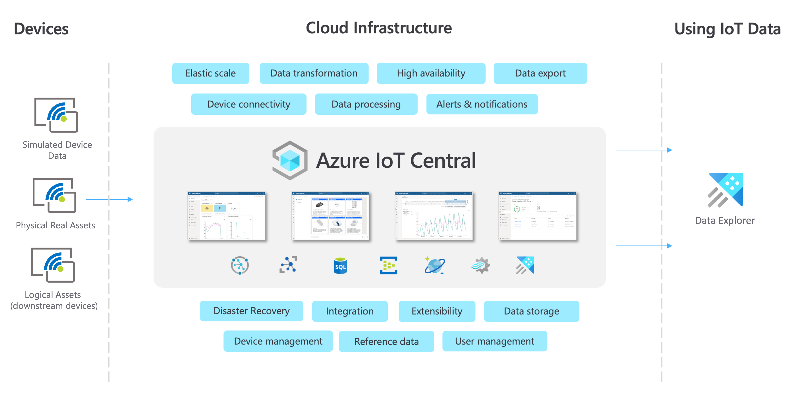
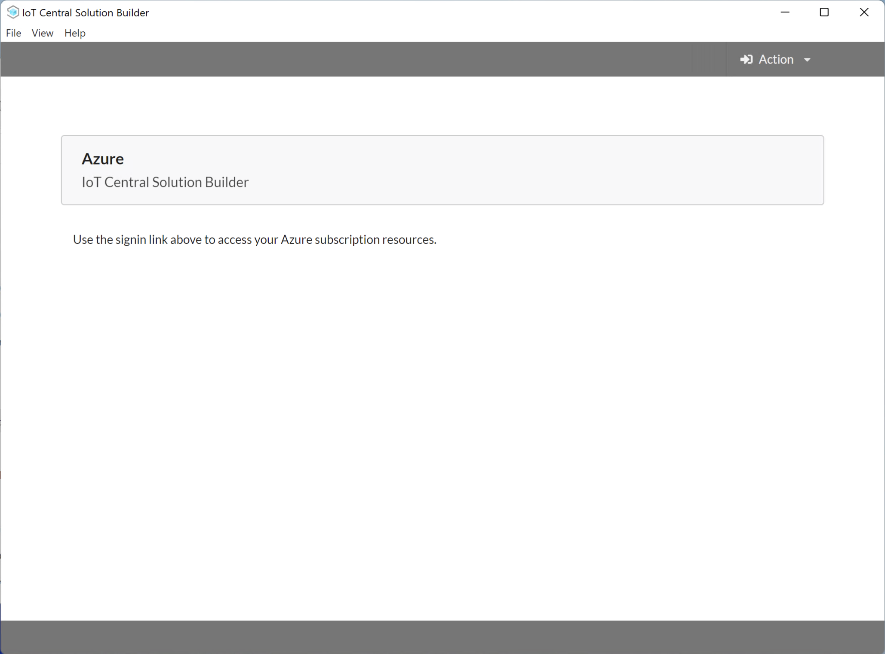
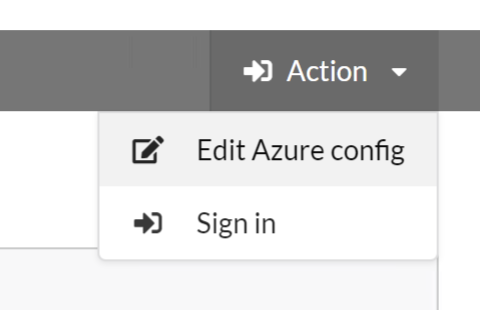
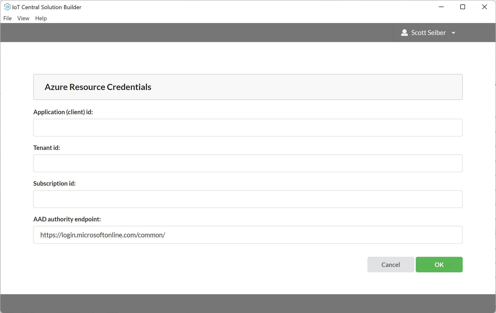
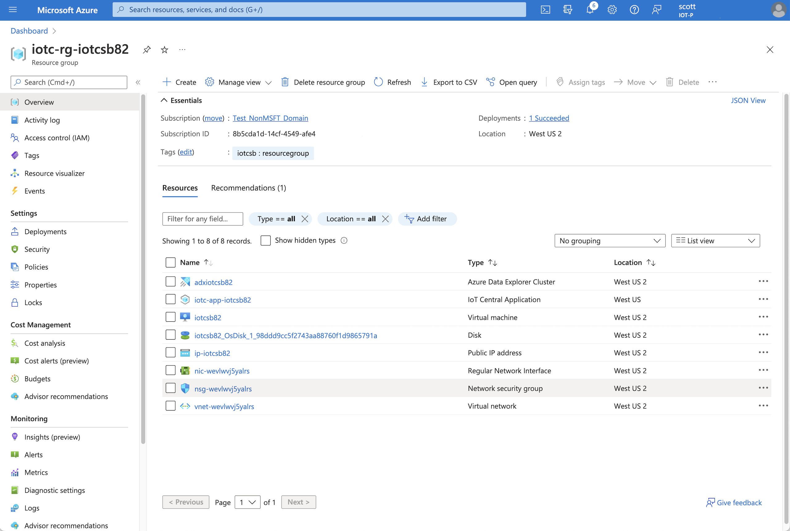
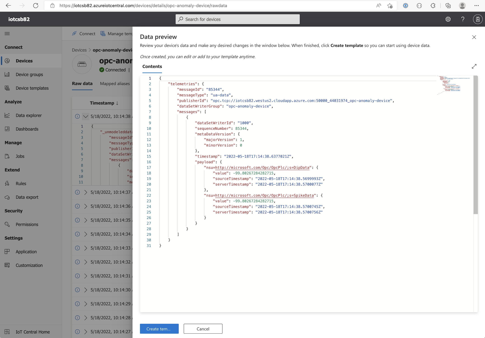
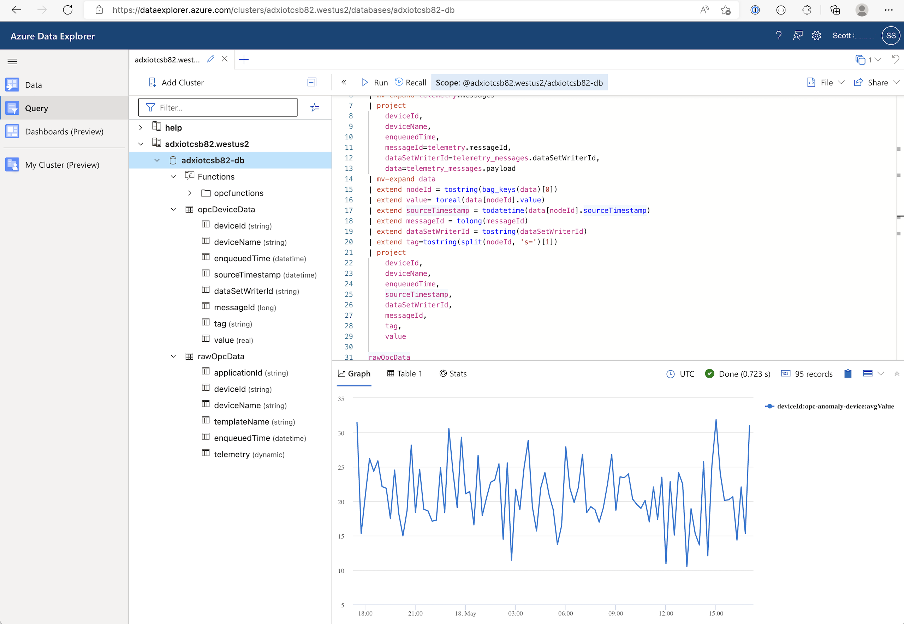

# Ingest Industrial Data with Azure IoT Central and Calculate OEE
This sample will demonstrate how to provision Azure IoT Central to ingest Industrial IoT data from edge resources and then export the data through to Azure Data Explorer for further analysis.

This sample uses a custom tool (the IoT Central Solution Builder) to provide a simple experience to deploy actual Azure resources into your subscription, which helps you understand the common components involved in the industrial scenario. After the tool completes all of the steps you can begin to play with the data in your Azure Data Explorer resource. You can examine any one of the steps in involved in the deployment with links to directly to the documentation. This includes the ARM resource deployments for the resource group, Azure IoT Central, Azure Virtual Machine, Azure Edge Runtime, and Azure Data Explorer, database, and necessary tables to host the exported data, as well as the specific resource APIs used to stitch the scenario together.

This IoT Central architecture value propositions and the data flow in this sample are shown here:


# Setup
## Prerequisites
* An Azure account that includes an active subscription.[Create an account for free](https://azure.microsoft.com/free/?WT.mc_id=A261C142F) if you don't already have one.
  > Note
  >
  >You will need an Azure subscription where you have access to both Contributor role, and User Access Administrator role. If you do not have the right permissions, please reach out to your account administrator to grant you those permissions.
* An AAD App Registration which will be the principal that will act on behalf of you (the Authorized AAD user) to deploy resources and call resource APIs. See the next section that describes the API permissions that are required.

## [Create an AAD App Registration](#create-an-aad-app-registration)
In order to use the IoT Central Solution builder with your Azure subscription you will need to create an app registration in your Active Directory. The app registration in your tenant enables you and others to authenticate against your Azure Active Directory and make the API calls necessary to create the Azure resources. 

* Install Azure CLI  
You can find specific documentation on how to install the Azure CLI tool here:  
https://docs.microsoft.com/en-us/cli/azure/install-azure-cli  

* Sign into your Azure AAD tenant:
  ```bash
  az login
  ```
* Select the subscription you would like to use:
  ```bash
  az account set -s "<your subscription id>"
  ```
* Create an AAD app registration
  > Note
  >
  >You may need to change the "--display-name" property suite your needs if an existing app registration is already using that name.

  ```bash
  az ad app create \
    --display-name "IoT Central Solution Builder" \
    --enable-access-token-issuance false \
    --enable-id-token-issuance false \
    --is-fallback-public-client false \
    --public-client-redirect-uris "msald38cef1a-9200-449d-9ce5-3198067beaa5://auth" \
    --required-resource-accesses "[{\"resourceAccess\":[{\"id\":\"00d678f0-da44-4b12-a6d6-c98bcfd1c5fe\",\"type\":\"Scope\"}],\"resourceAppId\":\"2746ea77-4702-4b45-80ca-3c97e680e8b7\"},{\"resourceAccess\":[{\"id\":\"73792908-5709-46da-9a68-098589599db6\",\"type\":\"Scope\"}],\"resourceAppId\":\"9edfcdd9-0bc5-4bd4-b287-c3afc716aac7\"},{\"resourceAccess\":[{\"id\":\"41094075-9dad-400e-a0bd-54e686782033\",\"type\":\"Scope\"}],\"resourceAppId\":\"797f4846-ba00-4fd7-ba43-dac1f8f63013\"},{\"resourceAccess\":[{\"id\":\"e1fe6dd8-ba31-4d61-89e7-88639da4683d\",\"type\":\"Scope\"}],\"resourceAppId\":\"00000003-0000-0000-c000-000000000000\"}]" \
    --sign-in-audience "AzureADandPersonalMicrosoftAccount"
  ```
  After running this command, the output will include an "appId" property.

# Run the IoT Central Solution Builder
After installing IoT Central Solution Builder using the platform specific installer, run the tool and you should see this UI:  


Select the "Edit Azure config" option from the menu at the top of the screen:  


This is where you enter the properties you collected from the [AAD App Registration](#create-an-aad-app-registration) section:  


After selecting OK use the menu again to sign in. You will be prompted for your Azure credentials. Be sure to sign in with the same user credentials you used to access the Azure Portal and create your AAD App Registration.

Once you are authenticated with the Azure Active Directory select the "Open Configuration" button to load the ADX OEE Solution template. Then select the Start Provisioning button. You will be asked to confirm the name prefix for your resources and the regional location to use when deploying the resources.
  > Note
  >
  >The IoT Central resource in this sample deploys by default into the "West US" region. If you wish to change the location to use for your IoT Central resource you can edit the configuration file directly.  

You can watch as each step is executed in sequence. Each step also includes links to the documentation for the ARM resource and the API documentation. After each step is finished you will see a "completed" label appear as well as the resource name that was used for the deployment.

In approximately 15m. you will be able to see the deployed resources in the Azure Portal.  


You can navigate to the IoT Central application and inspect the device template for the gateway as well as the edge device and downstream device instances that were created. You will be able to see raw OPCUA data which is being ingested into IoT Central.  


A data export is also configured for you which exports the raw data into an Azure Data Explorer instance with a database, and a data ingestion table and a streaming ingestion policy pre-configured for you. The raw data is also transformed into a final table with a table schema that shows the specific OPCUA variables that are subscribed.  


# Download
You can download the Windows pre-built executables for the IoTC Solution Builder directly from our [release](https://github.com/iot-for-all/iotc-solution-builder/releases) page.

# Build the Tool
In order to generate binaries for other platforms, feel free to clone this project and customize it to fit a particular scenario.
## Prerequisites
* [Node.js](https://nodejs.org/en/download/) v16 or later
* [Visual Studio Code](https://code.visualstudio.com/Download) with [ESLint](https://marketplace.visualstudio.com/items?itemName=dbaeumer.vscode-eslint) extension installed

## Installation
Clone the repo and install dependencies:

```bash
git clone --depth 1 --branch main https://github.com/iot-for-all/iotc-solution-builder.git
cd iotc-solution-builder
npm install
```
Make the platform specific setup packages:
```bash
npm run make
```
After the make command completes you will find the platform specific builds in the `./out` directory.
